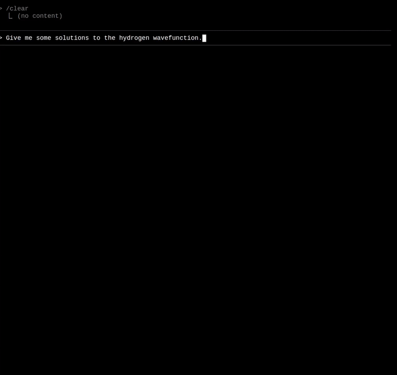

<div align="center">
  

  Display beautiful mathematical equations directly in your terminal

  
</div>

## Features

- **Zero-config** - Just load the addon and LaTeX works
- **Agent compatible** - Made for use with CLI AI tools
- **Inline & Display Math** - Support for both `$...$` and `$$...$$`
- **Heuristic Detection** - Distinguishes between LaTeX and shell variables
- **Theme Aware** - Automatically matches terminal colors

## Installation

```bash
npm install xterm-latex
```

## Quick Start

```javascript
import { Terminal } from '@xterm/xterm'
import { LatexAddon } from 'xterm-latex'

const terminal = new Terminal()
const latexAddon = new LatexAddon()

terminal.loadAddon(latexAddon)
terminal.open(document.getElementById('terminal'))

terminal.write('The equation $E = mc^2$ is not the whole story\n')
```
### Important: Make your AI aware that it can write in LaTeX. We reccomend you include the attached 'recPrompt.txt' in the model context.

## Examples

### Inline Math
```javascript
terminal.write('Inline equation: $\\sqrt{x^2 + y^2}$\n')
terminal.write('Greek letters: $\\alpha, \\beta, \\gamma$\n')
```

### Display Math
```javascript
terminal.write('$$\\int_0^\\infty e^{-x^2} dx = \\frac{\\sqrt{\\pi}}{2}$$\n')
```

### Matrices (using @nl macro)
```javascript
// Use @nl instead of \\ for row separators (PTY-safe)
terminal.write('$$\\begin{bmatrix} 1 & 2 @nl 3 & 4 \\end{bmatrix}$$\n')
```

### Custom Macros
```javascript
const latexAddon = new LatexAddon({
  macros: {
    '@nl': '\\\\',      // Row separator (necessary)
  }
})

terminal.write('Gradient: $@del f = (@del_x f, @del_y f)$\n')
```

## Configuration

```javascript
const latexAddon = new LatexAddon({
  // Enable debug logging
  debugLogging: false,

  // Custom macros for easier input
  macros: {
    '@nl': '\\\\',
    // Add your own macros here
  },

  // Maximum cached equations (default: 5000)
  cacheSize: 5000,

  // Minimum placeholder width in characters (default: 4)
  minPlaceholderWidth: 4,

  // Custom logging function
  onLog: (message) => console.log(message)
})
```

## Advanced Usage

### Manual Components

For more control, you can use the components individually:

```javascript
import { LatexProcessor, OverlayManager } from 'xterm-latex'

const processor = new LatexProcessor(terminal, config)
const overlayManager = new OverlayManager(terminal, processor.getLatexMap())
```

### Enable/Disable at Runtime

```javascript
// Disable LaTeX rendering
latexAddon.setEnabled(false)

// Re-enable it
latexAddon.setEnabled(true)
```

### Update Configuration

```javascript
latexAddon.updateConfig({
  debugLogging: true,
  macros: {
    '@sum': '\\sum'
  }
})
```

## How It Works

'terminal.write()' is hooked (notably NOT all pty data, just what is forwarded to render) and inline math is filtered out. Detected LaTeX is then removed from the display stream and replaced with a 4 character deterministic base63 hash generated in latex-hashmap.ts. We also pre-render the LaTeX and associate that pre-rendering with the generated hash. Rendering logic in overlay-manager then decides where to place this relative to the terminal and responds to things like zoom, scroll.

Import drawbacks:
Because terminals often have uses for the LaTeX operator '\\\\' and '\\\\\\\\', these cannot be directly used, and we 
replace them with a safe macro @nl, and the AI must be told to write with this constraint. An interface is provided for more custom macros, in case there are user specific LaTeX operands that may not work in their environment. 
 
### Xterm MUST use the DOM renderer for this plugin to function

## Related Projects

### Obsidian Plugin
The [obsidian-latex-terminal](https://github.com/MaxwellsEquation/LaTerM-obsidian) plugin uses this library to bring LaTeX rendering to Obsidian's terminal emulator. It's included as a submodule in the `plugins/` directory.

## License

MIT

## Contributing

Contributions welcome! Please feel free to submit a Pull Request.
Things that could be expanded upon are the heuristic used to detect LaTeX, better support for writing LaTeX manually
in terminal, and that inline math expressions with fractions often render on top of eachother (which is more the AIs fault most of the time).

